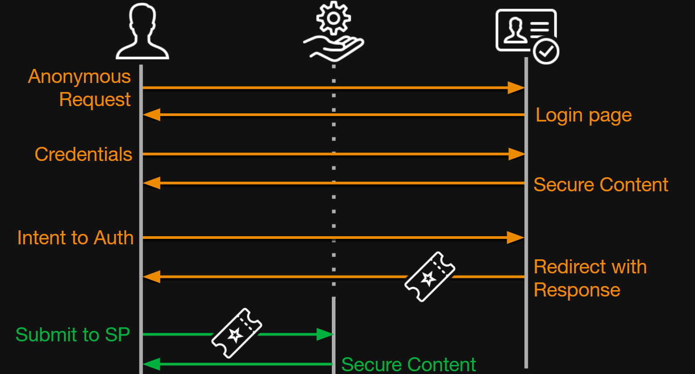
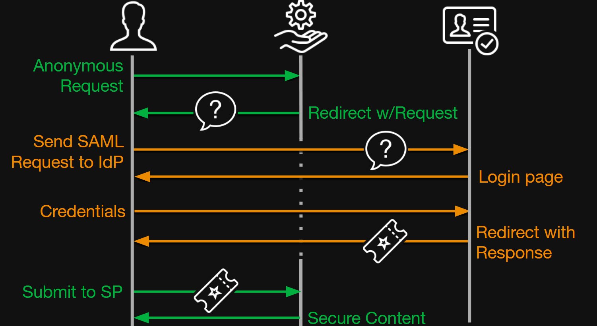

Misconfigured Single Sign-On (SSO) can compromise your service by handing out golden tickets to attackers. Let's learn about the basics of SSO-enabled services, demonstrate some attacks, and discover how to prevent your service from being similarly compromised.

__This post has a companion talk given by me at BSides NoVA 2025.__
<iframe width="560" height="315" src="https://www.youtube.com/embed/RLvz8-2tjmg" title="YouTube video player" frameborder="0" allow="accelerometer; autoplay; clipboard-write; encrypted-media; gyroscope; picture-in-picture; web-share" referrerpolicy="strict-origin-when-cross-origin" allowfullscreen></iframe>
<br />

# SSO Crash Course
There are two key concepts within SSO: Identity Providers (IdPs) and Service Providers (SPs). Identity Providers serve as the source of truth, the origin for all information about users, their roles, and their group membership. This includes attributes like first and last name, and login credentials like passwords and multifactor tokens.


Service providers sit at the other side of the equation. Instead of storing user attributes and credentials, they trust the identity provider to send them.

## Common Protocols
The two common protocols for SSO are OAuth (2.0 and 2.1, not an acronym) and Security Assertion Markup Language (SAML) 2.0. Both protocols establish procedures for IdPs and SPs to communicate. Although they are similar in capability, in my experience, OAuth tends to be more popular for open-source integrations and SAML tends to be more popular around the Microsoft ecosystem. One notable difference is that SAML payloads are fully transparent to the user, which is why we will focus on that for the rest of this post.

## SAML Basics
The main idea behind SAML is the Assertion. A SAML Assertion __asserts__ something as true, with certain mechanisms to prove its validity.

There are two "flows" by which SAML authentication can occur; that is, there are two mechanisms that allow a user to log in. Let's go through each, as both of them are susceptible to the attacks in question.

### IdP-Initiated Login
Some IdPs provide a dashboard that companies may use as an intranet portal or central location for a bunch of links to company services. For example, Okta provides this out of the box. When the user clicks one of the links, they can be immediately logged in using IdP-initiated login.



For these vertical timeline diagrams, I would recommend watching the companion talk for a more direct walkthrough. I understand these flows are not very friendly, but they really are the best way to understand these protocols.

The key part of this flow is the step where the user submits the `<SAMLResponse />` near the end. That is strange, right? How does the service provider know the user did not just submit garbage? Hold on to that thought: That is the principle idea behind the attacks we will explore later.

### SP-Initiated Login
This flow, although containing more steps, is more likely what you imagine if you have experience using SSO-powered services. In SP-initiated login, the user first tries to connect to the service, but immediately gets redirected to the IdP to fill in their credentials. After that, this flow is the same as IdP-initiated login. 



Once again, we have that key step where the SP trusts the `<SAMLResponse />` that the user sends.

# SAML Integrity
Finally, let's answer our key question. How can the service provider trust the `<SAMLResponse />`? The protocol uses two mechanisms: Lifetimes and signatures.

## SAML Lifetimes
The first and more simple integrity mechanism is Lifetimes. Every `<SAMLResponse />` can include `NotBefore`, `NotOnOrAfter`, and `IssueInstant` attributes which instruct the SP to fail the payload if the current time is not within those parameters. Every SP must recognize and act on these parameters to be spec-compliant. However, defeating these attributes is extremely simple, as we can just rewrite them with new, valid timestamps.

Additionally, for SP-initiated login only, the SP can include a "Solicitation Identifier," called an `ID` attribute in the `<AuthnRequest />` and `InResponseTo` attribute in the `<SAMLResponse />`, which uniquely represents this one login instance. Once again, this must be verified to be spec-compliant. This is slightly more tricky to defeat, as we have to make a prerequisite anonymous call to the service to have it generate a fresh `<AuthnRequest />` for us. Then, we can extract the solicitation ID out of that request and inject it into our counterfeit response. But, if the service allows IdP-initiated login, it may choose to ignore the solicitation ID, allowing us to skip this step.

Finally, we have the `<OneTimeUse />` condition. The intention for this is to have the SP track whether this response (identified by its `ID` attribute) has been submitted previously. If it has, it rejects it. Unfortunately, unlike the two above mechanisms, this condition is __stateful__. That is, the SP must use a stateful storage mechanism to correctly enforce one time use. For that reason, some SAML SP implementations ignore the `<OneTimeUse />` condition. This may be dubiously spec-compliant, but to the end user, it still "works." In my opinion, this should not be viewed as anything but a low-severity weakness, as remediating it would not meaningfully mitigate the attacks I will demonstrate later. 

## SAML Signatures
SAML also uses the XML Dsig standard to sign parts of the `<SAMLResponse />` payload. To create a signature, the signing entity (whoever is generating the payload) picks an XML element and hashes a serialized version of it and its children. Then, it calculates the signature based on this hash and its private key, and attaches this as a new element in the XML document.

As a quick side note, this "put the signature as part of the payload" strategy is unusual for this type of protocol. Most integrity protocols hash and sign the whole body and include the signature separately. This strategy is generally considered weak because parts of the payload may still be modified and preserve a valid signature. The recent [OpenPGP.js vuln, CVE-2025-47934](https://nvd.nist.gov/vuln/detail/CVE-2025-47934), was caused by exactly this. However, the attacks we are exploring do not exploit this weakness.

## Sample Payload
Let's look at a sample payload. This is a full, real `SAMLResponse`.
```
<samlp:Response xmlns:samlp="urn:oasis:names:tc:SAML:2.0:protocol" xmlns:saml="urn:oasis:names:tc:SAML:2.0:assertion" Destination="https://saml-demo.noahgearhart.com/saml/acs/" ID="ID_5302d583-16b2-452d-8cf9-e7b08a8970c7" InResponseTo="ONELOGIN_135e2dd36cdd4cd1fad82eeebfceb45e02418e5f" IssueInstant="2025-09-29T00:36:22.435Z" Version="2.0">
    <saml:Issuer>
        https://keycloak.noahgearhart.com/realms/Demo
    </saml:Issuer>
    <dsig:Signature xmlns:dsig="http://www.w3.org/2000/09/xmldsig#">
        <dsig:SignedInfo>
            <dsig:CanonicalizationMethod Algorithm="http://www.w3.org/2001/10/xml-exc-c14n#"/>
            <dsig:SignatureMethod Algorithm="http://www.w3.org/2001/04/xmldsig-more#rsa-sha256"/>
            <dsig:Reference URI="#ID_5302d583-16b2-452d-8cf9-e7b08a8970c7">
                <dsig:Transforms>
                    <dsig:Transform Algorithm="http://www.w3.org/2000/09/xmldsig#enveloped-signature"/>
                    <dsig:Transform Algorithm="http://www.w3.org/2001/10/xml-exc-c14n#"/>
                </dsig:Transforms>
                <dsig:DigestMethod Algorithm="http://www.w3.org/2001/04/xmlenc#sha256"/>
                <dsig:DigestValue>
                    lnLQwhAgSQ9y5oD5BEo3NqvSbyLQNEDnLVXacYvEkU8=
                </dsig:DigestValue>
            </dsig:Reference>
        </dsig:SignedInfo>
        <dsig:SignatureValue>
            D8tFH6JUrXt1ZQPAaLUG7OoNfNkN8HiGzKS6iDIDrhIxfTJY/wxejBYEeBPcSfVCiWZ3c6I0sARUnWPERjZ8mtkJlfbFdhPvl0XYZjv0T94oF9ijw7jYq2jAuH9lnbn9jY3/kuafVaXtHxYE/666xWnJ4bYZ4Y6/ZWhM8oPu+IzSvnQ1dG/T9/QmLpEGYVSFn3TJZBzy9yTLC3Mar3IJDGA0J9L4CL7JprCRK9p5in+kTOC0u6ILctscAZrPIDH6a0JmT3kI+MbjK+GrUA2DC+VDG6v23R0RhFzS3/WU06ejf2yFgZ5EzF/WZ+6xJNcWSKwNm8/UuaRjkI5AA+i6MA==
        </dsig:SignatureValue>
        <dsig:KeyInfo>
            <dsig:X509Data>
                <dsig:X509Certificate>
                    MIIClzCCAX8CBgGZX7Cq9jANBgkqhkiG9w0BAQsFADAPMQ0wCwYDVQQDDAREZW1vMB4XDTI1MDkxOTAxNTUzN1oXDTM1MDkxOTAxNTcxN1owDzENMAsGA1UEAwwERGVtbzCCASIwDQYJKoZIhvcNAQEBBQADggEPADCCAQoCggEBALWrPZNUDmavVicPUh9+bOlw4QTgPDAZ01ktIV0ApeLxaN8Nfdy7Q0D7EkvWZhu76LZP4rCmbwzFQ78pqUaYG5iwHRbaErg+wFx0Xvne9vBvCC51tDdAk3FRnTZiQcE0FpZcr9KAesKFv68YacWDpuyBLadzqNykflJo8rHDnxOGXZGIHt28/zwc3Z3Pj9cmROc9/9D+LCa049SLJoLGu39m7W3lY4Xr4YxWMkc/JBsROA2FuQe40P/U1A1qHVYFP8wjjJW7aWZoQQHvpwZ8/grz0Ozi0JdjLLNHjyYtwk5XhvgU28abjGRCZ+wtGzWO9dy7FCcVrjFzR2fVAzifm+sCAwEAATANBgkqhkiG9w0BAQsFAAOCAQEAUiA9LfZSyOtTCiqvsRkYPQz1P6jy2ied5YbwnuRDWZJ2Zy9wUWzKJrVuWcPYNo4Jt6vFWyjrm9PmgxqmIdtCxobu3V+tFokzTvu9cbLmRb+oDjiN30eAgwug61El1NJ2mUvVjuD1vJtQ25uiOiHQOsmMNDhIHMQpeoryXnvFT7iwq5YAThfPBV0eC+cDTZfe4lz8IbST8efGtwzZmV+WlufP0wc7cIYrOQCyuZHTM3VzCuRjI8n7YPB4UHLDVRp8MWEf26/tFsePgzPayqz0yzP9eeK5VM2N1iD0+Y2QtS4L2yxMD+cLgiO1U+FgmxppvdWfxuX/UeydZ+xrBBTE5g==
                </dsig:X509Certificate>
            </dsig:X509Data>
        </dsig:KeyInfo>
    </dsig:Signature>
    <samlp:Status>
        <samlp:StatusCode Value="urn:oasis:names:tc:SAML:2.0:status:Success"/>
    </samlp:Status>
    <saml:Assertion xmlns="urn:oasis:names:tc:SAML:2.0:assertion" ID="ID_f7bc3465-deed-4cdb-86b6-0077e65b8064" IssueInstant="2025-09-29T00:36:22.431Z" Version="2.0">
        <saml:Issuer>
            https://keycloak.noahgearhart.com/realms/Demo
        </saml:Issuer>
        <saml:Subject>
            <saml:NameID Format="urn:oasis:names:tc:SAML:2.0:nameid-format:transient">
                noah.user
            </saml:NameID>
            <saml:SubjectConfirmation Method="urn:oasis:names:tc:SAML:2.0:cm:bearer">
                <saml:SubjectConfirmationData InResponseTo="ONELOGIN_135e2dd36cdd4cd1fad82eeebfceb45e02418e5f" NotOnOrAfter="2025-09-29T00:41:20.431Z" Recipient="https://saml-demo.noahgearhart.com/saml/acs/"/>
            </saml:SubjectConfirmation>
        </saml:Subject>
        <saml:Conditions NotBefore="2025-09-29T00:36:20.431Z" NotOnOrAfter="2025-09-29T00:37:20.431Z">
            <saml:AudienceRestriction>
                <saml:Audience>
                    https://saml-demo.noahgearhart.com
                </saml:Audience>
            </saml:AudienceRestriction>
        </saml:Conditions>
        <saml:AuthnStatement AuthnInstant="2025-09-29T00:36:22.435Z" SessionIndex="8c82c79c-f799-432d-a629-9b753c35e9d8::5bb2a71b-b81a-4b11-8c31-0c37bb3a31e1" SessionNotOnOrAfter="2025-09-29T10:36:22.435Z">
            <saml:AuthnContext>
                <saml:AuthnContextClassRef>
                    urn:oasis:names:tc:SAML:2.0:ac:classes:unspecified
                </saml:AuthnContextClassRef>
            </saml:AuthnContext>
        </saml:AuthnStatement>
        <saml:AttributeStatement>
            <saml:Attribute FriendlyName="uid" Name="uid" NameFormat="urn:oasis:names:tc:SAML:2.0:attrname-format:basic">
                <saml:AttributeValue xmlns:xs="http://www.w3.org/2001/XMLSchema" xmlns:xsi="http://www.w3.org/2001/XMLSchema-instance" xsi:type="xs:string">
                    noah.user
                </saml:AttributeValue>
            </saml:Attribute>
            <saml:Attribute Name="Role" NameFormat="urn:oasis:names:tc:SAML:2.0:attrname-format:basic">
                <saml:AttributeValue xmlns:xs="http://www.w3.org/2001/XMLSchema" xmlns:xsi="http://www.w3.org/2001/XMLSchema-instance" xsi:type="xs:string">
                    manage-account
                </saml:AttributeValue>
                <saml:AttributeValue xmlns:xs="http://www.w3.org/2001/XMLSchema" xmlns:xsi="http://www.w3.org/2001/XMLSchema-instance" xsi:type="xs:string">
                    offline_access
                </saml:AttributeValue>
                <saml:AttributeValue xmlns:xs="http://www.w3.org/2001/XMLSchema" xmlns:xsi="http://www.w3.org/2001/XMLSchema-instance" xsi:type="xs:string">
                    uma_authorization
                </saml:AttributeValue>
                <saml:AttributeValue xmlns:xs="http://www.w3.org/2001/XMLSchema" xmlns:xsi="http://www.w3.org/2001/XMLSchema-instance" xsi:type="xs:string">
                    view-profile
                </saml:AttributeValue>
                <saml:AttributeValue xmlns:xs="http://www.w3.org/2001/XMLSchema" xmlns:xsi="http://www.w3.org/2001/XMLSchema-instance" xsi:type="xs:string">
                    default-roles-demo
                </saml:AttributeValue>
                <saml:AttributeValue xmlns:xs="http://www.w3.org/2001/XMLSchema" xmlns:xsi="http://www.w3.org/2001/XMLSchema-instance" xsi:type="xs:string">
                    manage-account-links
                </saml:AttributeValue>
            </saml:Attribute>
        </saml:AttributeStatement>
    </saml:Assertion>
</samlp:Response>
```

Take notice of the `ID` attributes, `<dsig:Signature>`, and `<saml:Conditions>`. These are the implementation of our integrity checks above. You could even take the `<dsig:SignatureValue>` and `<dsig:X509Data>` and confirm for yourself that this signature is valid!

# Misconfiguration Attack

Now that we have seen the basics of how SAML works, let's look at a misconfiguration attack. Remember that, for a signature to be useful, the service provider must verify the signature and reject responses within invalid signatures.

Unfortunately, some service providers support this weak configuration. When reading the [SAML standard from OASIS](https://www.oasis-open.org/standard/saml/), here is the relevant paragraph (§6.1.5):

> Countermeasures: In order to address these potential threats, a system that guarantees in-transit message integrity must be used. The SAML protocol and the SOAP binding neither require nor forbid the deployment of systems that guarantee in-transit message integrity, but due to this large threat, it is highly recommended that such a system be used. At the SOAP binding level, this can be accomplished by digitally signing requests and responses with a system such as XML Signature [XMLSig]. The SAML specification allows for such signatures; see the SAML assertion and protocol specification [SAMLCore]
for further information.

> If messages are digitally signed (with a sensible key management infrastructure, see Section 4.4) then the
recipient has a guarantee that the message has not been altered in transit, unless the key used has been
compromised.

Notice that the SAML standard only "highly recommends" signature checks, but a system can be fully specification-compliant and miss this critical step. I have been searching for compliance frameworks that call this out, and I have been able to find very little. For example, DISA Secure Technical Implementation Guide (STIG) Application Security Development (AppSecDev) v6 V-222398 requires that the Identity Provider sign responses, but does not mention service provider checking the signature validity. Please let me know if I missed any! 

To perform the attack, all we do is replay the same payload while adjusting subject attributes as desired. Since the service provider does not verify the signature, it cannot detect that these changes are invalid.

Check out the companion video to see this attack performed live.

Notably, this is not a vulnerability - this is the SAML protocol working as intended. Instead, this configuration would be called a Weakness and is tracked by [CWE-295](https://cwe.mitre.org/data/definitions/295.html).

# Golden SAML Attack
Fortunately, the previous attack is easy to mitigate by enabling signature verification. However, if we look at the SAML security guide again:
> If messages are digitally signed (with a sensible key management infrastructure, see Section 4.4) then the
recipient has a guarantee that the message has not been altered in transit, unless the key used has been
compromised.

What if the identity provider's signing key is compromised? With a compromised key, we can arbitrarily generate our own signed counterfeit responses. This is where the name of the attack comes from - with a compromised signing key, we can print as many arbitrary "golden" tickets as we want!

Importantly, compromising the private key for an Identity Provider might be easier than you would think. For example, any Keycloak realm administrator can add an arbitrary signing key to the Realm config. Entra ID administrators can perform a similar configuration.

Check out the companion video to see this attack performed live.

## Mitigation
It is especially notable that this attack is very difficult to audit. We send the service provider an otherwise completely valid response, so its audit logs will indicate nothing different than a success. Theoretically, you could configure an alert that connects your IdP and SP logs together, as an SP login without a corresponding IdP login is an indicator of compromise (IOC). In the real world, creating such an alert may be difficult or impossible.

Ultimately, the best mitigation for the golden SAML attack is to protect the private key. For example, many identity providers like Keycloak and Entra make the default signing key nearly unrecoverable by default. The only way to recover their keys is to perform many complex database operations while leaving a deep audit trail. Another reasonable strategy for protecting a private key is to use a "break the glass" cloud secrets manager that leaves an audit trail when an entity reads the key. 

# SAML Investigator and Other Red Team Tools

For this article and talk, I wrote a web tool that helps perform this attack. Check it out at [SAML Investigator](https://saml-investigator.noahgearhart.com/). Feel free to use this when learning, teaching, or troubleshooting SAML integrations. There are also great resources for performing SAML attacks beyond the investigator, like [these Burp extensions](https://github.com/snoopysecurity/awesome-burp-extensions?tab=readme-ov-file#oauth-and-sso).

# Connection to TLS
Although the specific attacks we have explored are focused on the SAML protocol, other integrity-checking protocols have relatable concepts. Let's compare the SAML attacks to TLS (formerly called SSL).

The misconfiguration attack is straightforward: Turn off TLS verification. For example, using `curl -k` or Python `requests.get(..., verify=False)` is the same concept as disabling client SAML signature verification. Just like how the SAML signatures protect your services, TLS verification is critical for TLS security. You should never use `curl -k` or `requests.get(..., verify=False)` in any context.

The equivalent of the golden SAML attack is also simple: We can craft our own valid counterfeit TLS responses using a compromised private key. Ultimately, it is imperative that any private key used for any cryptographic security operations must be kept secure.

# Conclusion
SSO and SAML empower your users by automatically provisioning access to services while keeping identity data centralized. However, the SAML protocol has some weaknesses that must be addressed. Always turn on SAML signature enforcement in services and protect private keys.

# References
- [Cyber Ark Golden SAML Attack Blog Post](https://www.cyberark.com/resources/threat-research-blog/golden-saml-newly-discovered-attack-technique-forges-authentication-to-cloud-apps)
- [MITRE ATT&CK™: T1606.002](https://attack.mitre.org/techniques/T1606/002/)
- Some icons present from [Icons8](https://icons8.com)

## See Also
- [SAMLSmith DEFCON 33 Talk](https://infocondb.org/con/def-con/def-con-33/samlsmith)
- [SSO Wars: The Token Menace DEFCON 27 Talk](https://www.youtube.com/watch?v=ObxxXU8GRMI)
